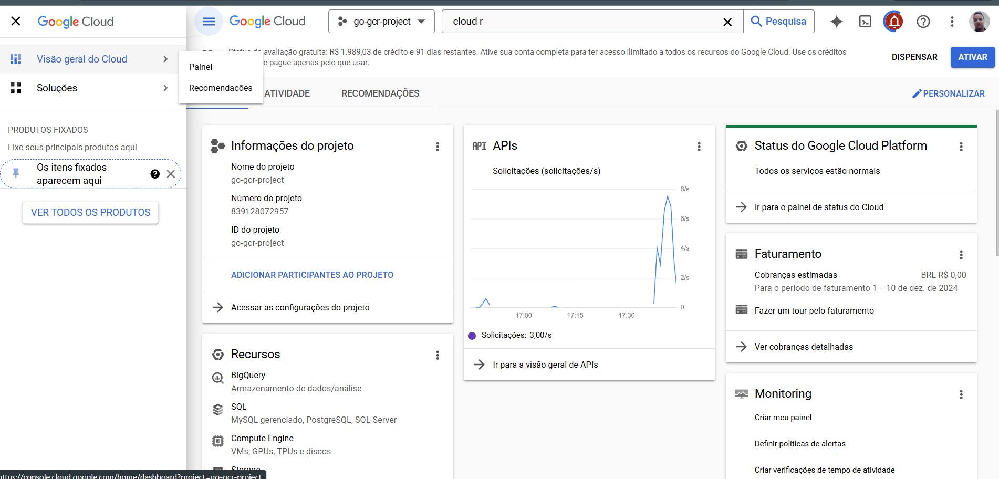

# go_google_cloud_run
Sistema em Go que receba um CEP, identifica a cidade e retorna o clima atual (temperatura em graus celsius, fahrenheit e kelvin). Esse sistema deverá ser publicado no Google Cloud Run.

## Passo a Passo para Rodar a Aplicação
Subindo os serviços com Docker:
docker-compose up --build

# Projeto no Google Cloud Run

